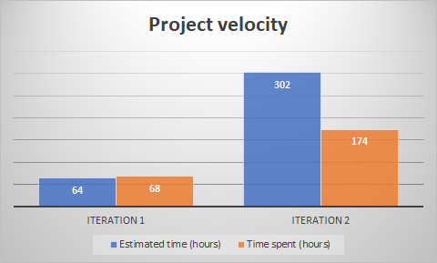

At the start of iteration 3, how our project was initially going to handle a signed-in user account was to have actvities send the user ID of the currently signed in user as part of the intent (once they signed in). When we started to go about it this way, we realized that all the activities would need to pass around the user ID between one another, even if the activity didn't need to know about the signed-in user. At the time, the HSQL database for accounts was not complete. However, upon working with the other functional HSQL databases, we realized that to get the signed-in user account's information, we would need to ask the database to fetch the account with the same user ID and return it. This would lead to a performance issue where if we only needed the information of the signed-in user account, we would still need to query the database, which took a noticable amount of time.

The problems we had to prevent included:
- Having every activity send the user ID as part of the intent.
- There are some activities that don't need to know about the signed-in user.
- Need to query the database anytime we need the signed in user.

We found that an easy way to solve all three problems was just to have a static variable of the signed-in user in the logic class dealing with accounts. For the first point, we now don't have to worry about forgetting to have an activity send the user ID as part of the intent and we no longer need to check if it was part of the intent. All new activities also don't have to worry about sending and recieving the intent. For the second point, we can now ignore activities that don't deal with accounts at all. For the third point, the only time we need to query the database would be to get the signed-in user (when they sign in) and when changes to the account have been made, such as adding a bookmark or order.

